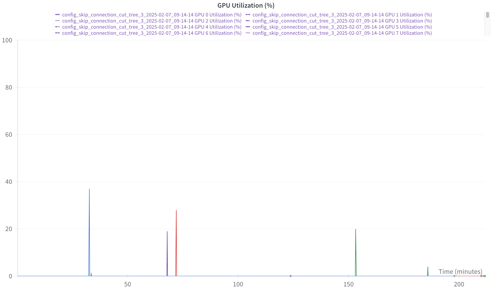
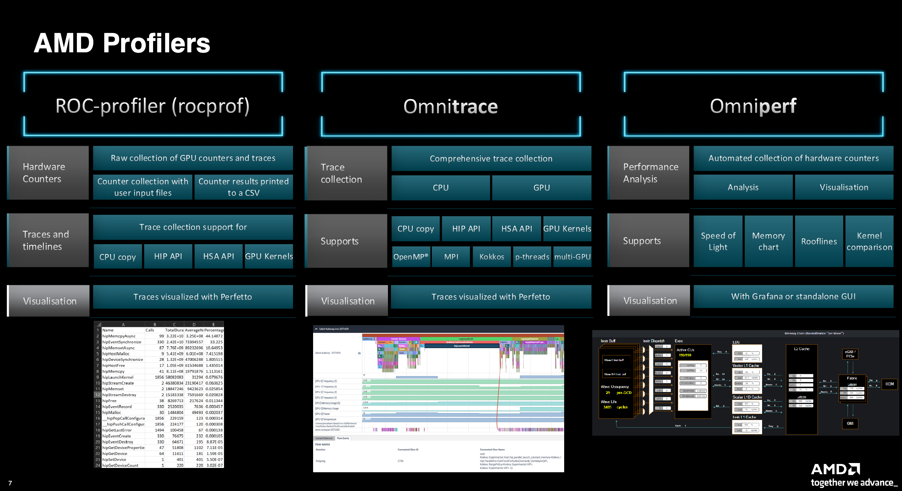
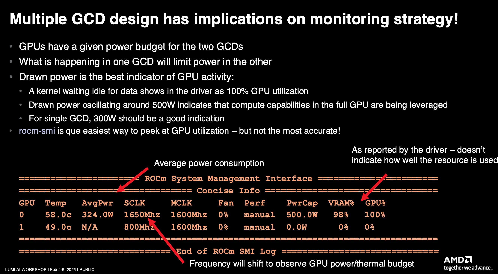

I started to write this tutorial because I had problem with GPU utilization, I reserved one node with 8 GPUs and send to pytorch lightning and what looking at log, it was laying to me :) I see it recognize GPUs and saying it is using them when training. But in reality gpu utilization look like this
-   
and all my computation was utilized purely by CPUs.

- 2 GPUs/GCD are for 500w, if power is around that level, it says GPUs are being leveraged
- if you use just single GPU then 300W is good indicator
- profiler rocprof, omnitrace, omniperf (kernel optimization)
- -   
- you also have option for profiling with torch.profiler, solved in torch lighting and wandb

to check in bash if you utilze GPU, you can do:
squeue --me
             JOBID PARTITION     NAME     USER ST       TIME  NODES NODELIST(REASON)
           9481771     dev-g     bash your_name  R      34:19      1 nid005007

then do:
srun --interactive --pty --jobid=9481771 rocm-smi

and you should see something like, where main to focus is power usage, for one GPU utilized, it should be at around 250W
