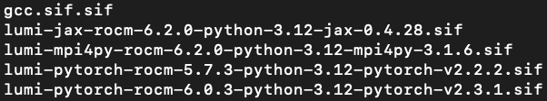

## 1. Resource Allocation on a Node

## One GPU, One-Eighth of a Node

- **Resources per GPU Slice**:
	**CPU Memory**: Each compute node has 512GB of CPU memory, but only 480GB are available per user. When divided into 8 equal slices (since 1 node is effectively split into 8 slices for the GPUs/GCDs), each slice gets 60GB of CPU memory.
- **CPUs**: Each GPU slice is allocated 7 CPU cores.
- **SLURM Option**:
•	In the SLURM script, you request --mem-per-gpu=60G because 60GB is the fair share per GPU slice (1/8th of 480GB).
•	**Note**: This memory is CPU RAM, not the GPU’s onboard memory (GPUs memory you have 64GB per GPU).


### Example SBATCH Script:
```bash
#!/bin/bash
#SBATCH --account=project_num
#SBATCH --partition=small-g # this allow you reserver just numbers of GPUs note whole node
#SBATCH --gpus-per-node=1
#SBATCH --ntasks-per-node=1
#SBATCH --cpus-per-task=7
#SBATCH --mem-per-gpu=60G
#SBATCH --time=0:15:00
```

## 2. Available GPU Partitions

- **standard-g**:
  -   Maximum runtime: ≤ 48h
  -   **Reserves whole nodes only**
  -   Up to 1024 nodes per job
- **small-g**:
    -   Maximum runtime: ≤ 72h
    -   **Allocates individual GCDs (good for single-GPU jobs)**
    -   Up to 4 nodes per job
- **dev-g**:
    -   Maximum runtime: ≤ 3h
    -   Allocates individual GCDs
    -   Up to 32 nodes per job (with a maximum of 2 jobs running concurrently)

## 3. Checking GPU Utilization and PyTorch Verification
- **Checking Utilization**:
    - Launch an interactive session on your job’s compute node:
```bash
srun --overlap --pty --jobid=<jobid> bash
```
- Then, run:
```bash
rocm-smi
```
This command displays GPU status and utilization.

- **Verifying in PyTorch**:
  - Even though LUMI uses ROCm, PyTorch uses the cuda namespace. To confirm your GPUs are visible:
  - But first you have to git torch in! Solved later, now we reserved GPUs, but have not placed torch in.
```bash
singularity exec $SIF python -c "import torch; print(f'Number of GPUs: {torch.cuda.device_count()}'); print(torch.cuda.get_device_properties(0))"
```

## 4. Understanding Singularity and Modules

## What is Singularity?

- **Singularity (also known as Apptainer)**:
    - It is a container technology designed for HPC environments.
    - **Container**: A container is a runtime instance of an image. In Singularity, container images are stored as .sif files (Singularity Image Files).
  - **Image vs. Container**:
    - **Image**: The file (e.g., lumi-pytorch-rocm-6.0.3-python-3.12-pytorch-v2.3.1.sif) that contains the entire software stack (Python, PyTorch, ROCm libraries, etc.).
    - **Container**: The running instance created when you execute the image. You might run the same image many times, each time creating a new container.
      - When you execute (or “run”) an image using a tool like Singularity, you create a container—an isolated environment in which your application runs
      - `singularity exec $SIF python your_script.py` here, $SIF is an environment variable set by the module that contains the full path to the correct Singularity image.
  - **Why Use a Container?**
    - It bundles all dependencies (including specific versions of PyTorch, CUDA/ROCm libraries, etc.) so that you don’t have to install packages on the shared system. This reduces stress on the network file (Conda created tens of thousands small files, which has to be queried each time) system and ensures consistency across runs.


- To find images of containers at prebuild torch-roc, see:
```bash
ls /appl/local/containers/sif-images
```


## What are Modules?

- **Modules**:
  - HPC systems like LUMI use Environment Modules to manage different software versions, more info [here](https://docs.lumi-supercomputer.eu/runjobs/lumi_env/Lmod_modules/#module-avail).
  - Modules let you quickly switch between different software versions (e.g., Python, compilers, or libraries) and ensure that the right dependencies are in your environment.
  - **module load <module-name>**: Loads a specific software package (or a set of packages) into your environment.
  - **module use <path>**: Adds a directory to the module search path.
    - How to create own modules can be found here, [Lmod](https://lmod.readthedocs.io/en/latest/index.html).
  - **module purge**: Removes all currently loaded modules. This ensures that your environment starts clean, reducing conflicts between different software versions.
- **Module Spider**:
  - The command module spider searches for modules and shows you all the available versions and any additional steps needed to load them.
  - Running in bash `module spider pytorch` might output:
    - 


How It Comes Together in the Script:
	•	Setting Up the Environment:
	•	The script begins by purging any preloaded modules (module purge), then adds the directory with the desired modules (module use /appl/local/training/modules/AI-20240529/), and finally loads the necessary Singularity modules.
	•	Launching the Container:
	•	The command srun singularity exec $CONTAINER python GPT-neo-IMDB-finetuning.py ... does the following:
	•	srun: Submits the job command under SLURM.
	•	singularity exec $CONTAINER: Launches a container from the specified Singularity image file (.sif file) and executes the following command inside the container.
	•	python GPT-neo-IMDB-finetuning.py ...: Runs your Python script (in this example, for fine-tuning a GPT model).

    