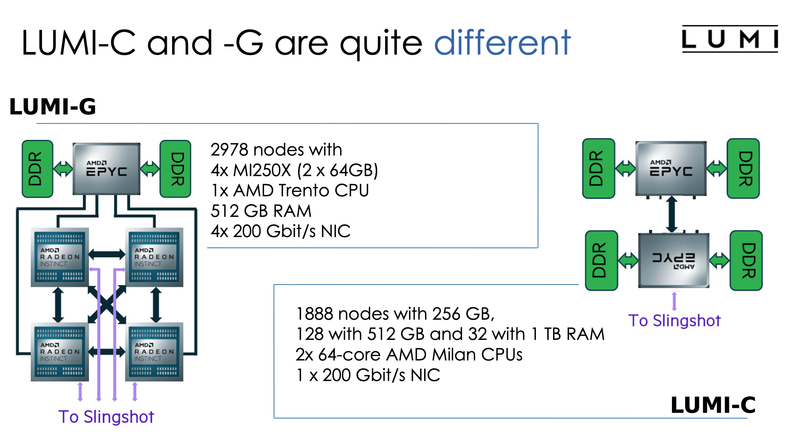

## Introduction to LUMI for AI Training

LUMI is one of Europe’s fastest supercomputers—a distributed system made up of thousands of individual nodes connected via high-speed HPE Slingshot interconnects. Because it’s not a single monolithic machine, your workflow and data management practices will differ from those on a local computer. Below is a practical guide covering the main aspects of LUMI’s hardware and storage systems that you need to know when running your PyTorch training jobs.

### 1. **Compute Nodes**

Types of Nodes
- **Login Nodes (UAN)**:
Used for code editing, job preparation, and initial submissions. These are your “front door” into LUMI.

```
ssh lumi_account@lumi.csc.fi 
```

- **CPU Compute Nodes (LUMI-C)**:
	Equipped with AMD Milan CPUs. Use these for CPU-based tasks.

- **GPU Compute Nodes (LUMI-G)**:
Designed for heavy numerical work like deep learning.
Key specifications per GPU node:
	- GPUs: 4 × AMD Instinct MI250X, this is for node, so each node has 8 GPUs (2 x GCD)
	- Each MI250X has 2 Graphical Compute Dies (GCD).
	- Memory per GCD: ~64GB (each process can access up to 64GB max, even though the physical memory per GCD is 60GB in practice).
      - Because the nodes have only 480 GB available per user of the 512 GB, so 1/8th of that is a fair use per GPU. Which gives 60 GB. Note that this is CPU memory and not GPU memory!
	- Note: When training large language models (LLMs), plan for a maximum of 60GB per process—not 128GB—even though the GPU is built as a dual-GCD design.
	- CPU: 1 × AMD Trento
	- RAM: 512GB (for CPU tasks)
	- Networking: 4 × 200Gbit/s NICs
- **Visualization Nodes (LUMI-D)**:
  - Dedicated to visualization tasks.



### 2. **Storage Systems**

LUMI uses multiple storage systems, and compute nodes do not have local disks. Instead, you must use the shared storage provided:

Storage Types
- LUMI-P (Parallel Storage):
	- **Capacity**: 80PB
	- **Usage**: user home directories and persistent project data (configuration files and final results).
	- Path: /users/<username> (for configuration files, with a typical quota of around 20GB) and /project/<project> (for installations and final results).
- LUMI-F (Accelerated/Flash Storage):
  - **Capacity**: 8.5PB
  - **Usage**: For data that requires high bandwidth, such as during active training or data preprocessing.

- LUMI-O (Object Storage):
  - **Capacity**: 30PB
  - **Note**: This storage is not available on compute nodes; it’s used for other purposes.

### **Directory Usage**
- **User Home** (/users/<username>):
Store configuration files here (located on LUMI-P).
- **Project Persistent** (/project/<project>):
Use for installations and final results. Files remain until the project ends (**then you have 3 mounts till automatic deletions, LUMI has not backups!**).
- **Project Scratch** (/scratch/<project>):
For input data and intermediate results. These areas have larger quotas but may be purged after a period.
- **Project Flash** (/flash/<project>):
When you need extra high I/O bandwidth for your input data (note that this option is more expensive).

**The Lustre File System**

LUMI-P and LUMI-F are built on the Lustre file system, which splits file storage into two main parts:
- **Metadata Server (MDS)**:
Stores information (metadata) about files (such as location and size) but not the file content itself.
- **Object Storage Servers**:
Hold the actual file content.

**Important Tip**:
Lustre performs best with fewer, larger files. A large number of small files (**like those that might come from a Python virtual environment with 100K+ files**) causes a lot of metadata queries, which can overwhelm the MDS—similar to a DDOS attack. To avoid performance issues, consider bundling files (using formats like HDF5 or containerizing your environment).

### 3. Temporary Storage(/tmp)

- /tmp on Compute Nodes:
The /tmp directory on the compute nodes resides in memory (since there’s no local disk on computation nodes) he memory used for /tmp is included in the job memory allocation. If you plan to use /tmp for temporary files, be sure to allocate enough memory to accommodate it.
- On LUMI’s compute nodes, there is no local disk storage as you might have on your personal computer. Instead, the /tmp directory is provided in memory (RAM) and is used for temporary file storage during a job’s execution. This means that any file you write to /tmp is stored in the node’s allocated memory and **will be lost when your job ends**.
- **Avoiding I/O Bottlenecks**: For operations that require very fast read/write access and don’t need long-term storage, /tmp can be useful.
- example to access it:
```bash
export MIOPEN_USER_DB_PATH="/tmp/$(whoami)-miopen-cache-\$SLURM_NODEID"
export MIOPEN_CUSTOM_CACHE_DIR=\$MIOPEN_USER_DB_PATH

# Set MIOpen cache to a temporary folder.
if [ \$SLURM_LOCALID -eq 0 ] ; then
    rm -rf \$MIOPEN_USER_DB_PATH
    mkdir -p \$MIOPEN_USER_DB_PATH
fi
```
- Requesting memory in batch job:
```bash
--mem	# Set the memory per node
--mem-per-cpu	# Set the memory per allocated CPU cores
--mem-per-gpu	# Set the memory per allocated GPU
```
