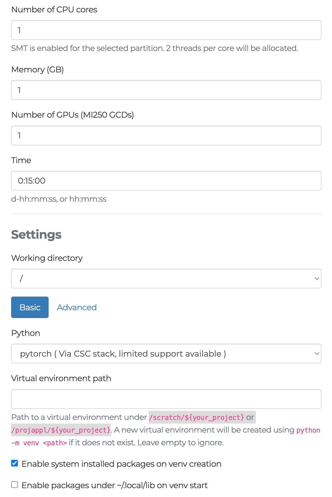

# Connecting via the Web Interface and Using Jupyter Notebooks

## 1. Accessing LUMI

- **Project Invitation**:
To log in, you must be invited to a project. If you are not the Principal Investigator (PI) for a project, you will receive an email invitation.

- **Access via Puhuri**:
Once invited, log in through the Puhuri portal. You must add your public key there so you can access the system via terminal.

- **Documentation**:
Detailed instructions are available in the [LUMI First Steps Guide]( https://docs.lumi-supercomputer.eu/firststeps/).

## 2. Web Interface & Jupyter Notebooks

LUMI provides a web interface with access to Jupyter notebooks at [LUMI Public Web Interface](https://www.lumi.csc.fi/public/).

**Note:**
- When you’re editing code or taking a break, the GPU remains allocated and idle—even though no computations are running. This means that while the resource is not being used, it is still reserved for your job.


## 3. Configuring a Jupyter Notebook Session

When launching a Jupyter notebook session, you have the ability to specify the following resources:
- **Time:** Specify the duration for your notebook session.
- **Memory:** Allocate the required amount of RAM.
- **CPUs:** Set the number of CPU cores.
- **GPUs (MI250)**:
  - **Important**: To request GPUs, you must choose a GPU partition (e.g., small-g).
    - **Available GPU Partitions**:
      - **standard-g**:
        - Maximum runtime: ≤ 48 hours
        - Allocation: Whole nodes only
        - Max: 1024 nodes/job
      - **small-g**:
        - Maximum runtime: ≤ 72 hours
        - Allocation: Individual GCDs
        - Max: 4 nodes/job
      - **dev-g**:
        - Maximum runtime: ≤ 3 hours
        - Allocation: Individual GCDs
        - Max: 32 nodes/job; up to 2 jobs running concurrently

To run PyTorch, choose the **pytorch (via CSC stack, limited support available)** option. This preset is configured for PyTorch, though it may have some limitations and will be revisited later in the tutorial.




## 4. Setting Up Your Virtual Environment

When launching Jupyter, you have an option to specify a Virtual Environment Path. Here’s how it works:
- **Virtual Environment Path**:
    - **What to Provide**:
Enter a path under `/scratch/${your_project}` or `/projappl/${your_project}`.
    - **Note**: `/projappl/` is old name for `/project`
	- **If the Path Does Not Exist**:
A new virtual environment will be created automatically using python -m venv <path>.
	- **Leaving It Blank**:
If you leave the field empty, no virtual environment will be set up (and you will use the default environment provided by the system).
- **Additional Options**:
  - **Enable system installed packages on venv creation**:
This option allows the new virtual environment to include packages that are already installed system-wide.
  - **Enable packages under ~/.local/lib on venv start**:
This makes any packages you have installed in your local user area available when the virtual environment starts.

- **Why It Matters**:
	- **Persistence**:
If you choose a specific path, the virtual environment will persist across Jupyter sessions. This means that if you install additional Python packages (using pip or another tool) within that virtual environment, they will remain available in future sessions.
	- **Ephemeral Environment**:
If you do not specify a virtual environment path (or leave it empty), any packages you install during your Jupyter session will not be saved permanently. They may be lost once the session ends.
	- **Best Practice**:
For a more stable and reproducible setup, it is recommended to specify a virtual environment path under `/scratch/${your_project}` or `/projappl/${your_project}`.

## 5. Torch and ROCm Versions (Example)

During a recent run, the following versions were observed:
- **Torch**: 2.5.1+rocm6.2
- **GPU**: AMD Instinct MI250X
- **ROCm IP Version**: 6.2.41134-65d174c3e
- **AMD Clang Version**:
```bash
AMD clang version 18.0.0git (https://github.com/RadeonOpenCompute/llvm-project roc-6.2.4 24392 1e2c94795ee0d6ab8e2ff3035965a6b74e11b475)
Target: x86_64-unknown-linux-gnu
Thread model: posix
InstalledDir: /opt/rocm-6.2.4/lib/llvm/bin
Configuration file: /opt/rocm-6.2.4/lib/llvm/bin/clang++.cfg
```


To log in, only option is be invited to project, and you have to receive email, If you are not PI of project. Then you use Puhuri, there you have to place your public key that enable you to log in, and access via terminal.

Explained in details here: https://docs.lumi-supercomputer.eu/firststeps/

With web interface provide jupyter notebooks: https://www.lumi.csc.fi/public/.


**Note**:
- Most of the time, when you are editing code or grabbing a
coffee , the GPU is idle (but nobody else can use it!)

You have option when running jupyter notebook to choose jupyter, and there I can ask for time, memory, number of gpus (MI250), and number of CPUs. For asking GPUs you need to choose partition with GPU, as small-g. Then to be able to run pytorch you choose option pytorch (Via CSC stack, limited support available). And to include more packages from your environment, this option is supported but have to be from /scratch/${your_project} or /projappl/${your_project} or if not provided it will created on run 


GPUs partitions are:
Available GPU partitions
• standard-g
≤ 48h, whole nodes only, max 1024 nodes/job 
small-g
≤ 72h, individual GCDs, max 4 nodes/job
• dev-g
≤ 3h, individual GCDs, max 32 nodes/job, max 2 job running

During my run, I have this torch, ROC versions:
- 2.5.1+rocm6.2
- AMD Instinct MI250X
- IP version: 6.2.41134-65d174c3e
AMD clang version 18.0.0git (https://github.com/RadeonOpenCompute/llvm-project roc-6.2.4 24392 1e2c94795ee0d6ab8e2ff3035965a6b74e11b475)
Target: x86_64-unknown-linux-gnu
Thread model: posix
InstalledDir: /opt/rocm-6.2.4/lib/llvm/bin
Configuration file: /opt/rocm-6.2.4/lib/llvm/bin/clang++.cfg